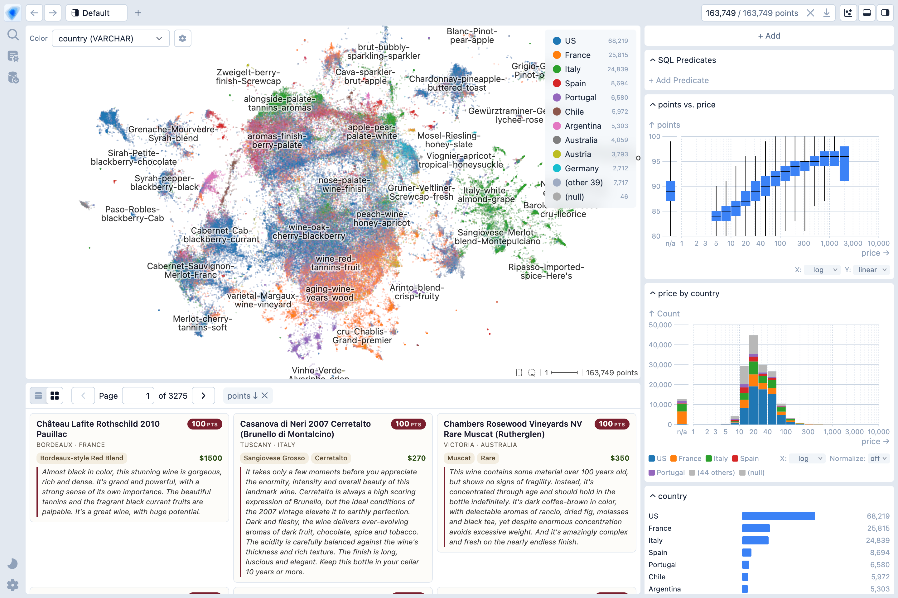

# Embedding Atlas

[](https://www.npmjs.com/package/embedding-atlas)
[](https://pypi.org/project/embedding-atlas/)
[](https://arxiv.org/abs/2505.06386)

[](./LICENSE)

Embedding Atlas is a tool that provides interactive visualizations for large embeddings and their metadata. You can visualize, cross-filter, and search across your data.

**For embeddings**

- 🏷️ **Automatic data clustering & labeling:**
  Interactively visualize and navigate overall data structure.

- 🫧 **Kernel density estimation & density contours:**
  Easily explore and distinguish between dense regions of data and outliers.

- 🧊 **Order-independent transparency:**
  Ensure clear, accurate rendering of overlapping points.

- 🔍 **Real-time search & nearest neighbors:**
  Find similar data to a given query or existing data point.

- 🚀 **Smooth performance at scale:**
  Up to a few million points, powered by WebGPU.

**For any tabular data**

- 📊 **Linked dashboards & cross-filtering:**
  Standard chart types (bar, line, bubble, count plot, eCDF) plus a composable chart spec for building custom charts like heatmaps and average-line overlays. Charts can be configured to cross-filter.

- 🧩 **Multimodal data support:**
  Built-in viewers for text, image, audio, numeric, categorical, and time columns.

- 🤖 **AI agent access via MCP:**
  AI agents can query the schema, run SQL, create charts, and capture screenshots via Model Context Protocol.

Please visit <https://apple.github.io/embedding-atlas> for a demo and documentation.

<picture>
  <source media="(prefers-color-scheme: dark)" srcset="./packages/docs/public/assets/embedding-atlas-dark.png">
  
</picture>

## Get started

To use Embedding Atlas with Python:

```bash
pip install embedding-atlas

embedding-atlas <your-dataset>
```

In addition to the command line tool, Embedding Atlas is available as a Python Notebook (e.g., Jupyter) widget:

```python
from embedding_atlas.widget import EmbeddingAtlasWidget

# Show the Embedding Atlas widget for your data frame:
EmbeddingAtlasWidget(df)
```

Finally, components from Embedding Atlas are also available in an npm package:

```bash
npm install embedding-atlas
```

```js
import { EmbeddingAtlas, EmbeddingView } from "embedding-atlas";

// or with React:
import { EmbeddingAtlas, EmbeddingView } from "embedding-atlas/react";

// or Svelte:
import { EmbeddingAtlas, EmbeddingView } from "embedding-atlas/svelte";
```

For more information, please visit <https://apple.github.io/embedding-atlas/overview.html>.

## BibTeX

For the Embedding Atlas tool:

```bibtex
@misc{ren2025embedding,
  title={Embedding Atlas: Low-Friction, Interactive Embedding Visualization},
  author={Donghao Ren and Fred Hohman and Halden Lin and Dominik Moritz},
  year={2025},
  eprint={2505.06386},
  archivePrefix={arXiv},
  primaryClass={cs.HC},
  url={https://arxiv.org/abs/2505.06386},
}
```

For the algorithm that automatically produces clusters and labels in the embedding view:

```bibtex
@misc{ren2025scalable,
  title={A Scalable Approach to Clustering Embedding Projections},
  author={Donghao Ren and Fred Hohman and Dominik Moritz},
  year={2025},
  eprint={2504.07285},
  archivePrefix={arXiv},
  primaryClass={cs.HC},
  url={https://arxiv.org/abs/2504.07285},
}
```

## Development

For development instructions, please visit <https://apple.github.io/embedding-atlas/develop.html>, or check out `packages/docs/develop.md`.

## License

This code is released under the [`MIT license`](LICENSE).
